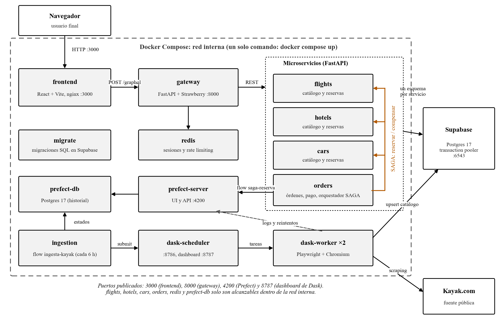

# WanderSync Travel Solutions

Plataforma de empaquetamiento turístico dinámico: busca y reserva vuelos, hoteles y autos como un solo paquete. Proyecto del Parcial 2 de Patrones Arquitectónicos Avanzados.

**Integrantes:** Eduard Meza y Juan José Campos.

El enunciado completo está en [Parcial 2 - Sistema de Reservas Turísticas.md](Parcial%202%20-%20Sistema%20de%20Reservas%20Turísticas.md).

> **Estado:** completo. Backend: gateway GraphQL, microservicios y SAGA ([services/](services/README.md)), ingesta de Kayak con Prefect + Dask ([ingestion/](ingestion/README.md)) y base de datos en Supabase ([db/](db/README.md)). Frontend ([frontend/](frontend/README.md)). Documento técnico de arquitectura en [docs/architecture/](docs/architecture/Documento_Tecnico_Arquitectura_WanderSync.docx).

## Entregables

| Entregable | Dónde |
|---|---|
| Código fuente, un Dockerfile por servicio y `docker-compose.yml` | Este repositorio |
| Documento técnico de arquitectura | [docs/architecture/Documento_Tecnico_Arquitectura_WanderSync.docx](docs/architecture/Documento_Tecnico_Arquitectura_WanderSync.docx) |
| Diagramas (arquitectura y secuencias del SAGA) | [docs/architecture/diagramas/](docs/architecture/diagramas/) |
| Auditoría de dependencias (pip-audit y npm audit) | [docs/security/](docs/security/) |
| Guion de la demostración | [Demostración](#demostración) y [scripts/smoke_test.py](scripts/smoke_test.py) |

## Stack

| Capa | Tecnología |
|---|---|
| Frontend | React + Vite, servido por nginx |
| API Gateway | FastAPI + Strawberry (GraphQL) |
| Microservicios | FastAPI (REST interno) |
| Base de datos | Supabase Cloud (Postgres) |
| Sesiones y rate limiting | Redis |
| Ingesta | Dask + Prefect, scraping de Kayak con Playwright |
| Observabilidad | Prefect: flows de ingesta y del SAGA (pasos y compensaciones) |
| Despliegue | Docker Compose |

## Arquitectura



```
React+Vite ──GraphQL──> Gateway ──REST──> Vuelos | Hoteles | Autos | Órdenes (SAGA)
                          │                                            │      │
                          └─> Redis                                    │      └─> Prefect (flow saga-reserva)
                                                                       v
Prefect ──> Dask scheduler ──> Dask workers ──────────────────────> Supabase (Postgres)
                                    │
                                    └─scraping─> Kayak
```

- El frontend habla **solo** con el gateway, y **solo** por GraphQL.
- El gateway traduce cada operación a llamadas REST internas. Los microservicios no publican puertos fuera de Docker.
- Órdenes orquesta el SAGA: reservar vuelo → hotel → auto → cobrar → confirmar. Si un paso falla, compensa en orden inverso. Cada reserva queda registrada en Prefect.
- Cada microservicio usa su propio esquema de Postgres.

Los diagramas de secuencia del SAGA están en [docs/architecture/diagramas/](docs/architecture/diagramas/): camino feliz (`seq_happy.png`), fallo del auto (`seq_car_fail.png`) y fallo del pago (`seq_pay_fail.png`).

## Estructura del repositorio

```
frontend/              Aplicación React + Vite (nginx en Docker)
services/
  gateway/             API Gateway GraphQL, autenticación, sesiones, rate limiting
  flights/             Microservicio de vuelos
  hotels/              Microservicio de hoteles
  cars/                Microservicio de autos
  orders/              Órdenes, facturación y orquestador SAGA
ingestion/
  flows/               Flows de Prefect
  scrapers/            Un scraper por vertical (vuelos, hoteles, autos)
  snapshots/           HTML guardado de corridas exitosas (respaldo para la demo)
  tests/               Pruebas de los parsers y del guardado, con páginas reales de Kayak
db/
  migrations/          Scripts SQL versionados para Supabase
prefect/               Imagen del servidor de Prefect
scripts/               Prueba de punta a punta (smoke_test.py)
docs/
  architecture/        Documento técnico y diagramas
  security/            Reportes de pip-audit y npm audit
```

## Responsables

| Área | Carpetas | Responsable |
|---|---|---|
| Backend | `services/`, `ingestion/`, `db/`, `prefect/`, `scripts/`, `docker-compose.yml` | Eduard Meza |
| Frontend | `frontend/` | Juan José Campos |

`docs/` es de ambos.

## Cómo trabajamos

- **El contrato entre ambos es el esquema GraphQL.** El gateway exporta el esquema a `services/gateway/schema.graphql`; el frontend lo usa como única referencia. Cualquier cambio en ese archivo se avisa antes de hacer merge.
- **Todo se trabaja directo en `main`.** Hagan `git pull` antes de empezar y commits pequeños para evitar conflictos.
- **Cada uno toca solo sus carpetas.** Si hace falta un cambio en el área del otro, se le pide.
- **Secretos:** las credenciales van en `.env`, que no se sube. Si se agrega una variable, se agrega también a `.env.example`.

## Puesta en marcha

1. Copiar `.env.example` a `.env` y completar `DATABASE_URL` con la cadena del **Transaction pooler** de Supabase (puerto 6543; ver [db/README.md](db/README.md)).
2. `docker compose up --build`. La primera vez tarda: descarga Chromium y la imagen de Prefect. Las migraciones se aplican solas antes de que arranquen los servicios.
   - Frontend: http://localhost:3000
   - API GraphQL (con GraphiQL): http://localhost:8000/graphql
   - Prefect: http://localhost:4200 (flow `ingesta-kayak` y una corrida de `saga-reserva` por cada reserva)
   - Dashboard de Dask: http://localhost:8787
3. Cargar el catálogo. La ingesta corre sola cada 6 horas; para no esperar, en Prefect: *Deployments* → `kayak-cada-6h` → *Run* → *Custom run*. Si Kayak bloquea, usar los parámetros de respaldo: `offline: true`, `destinations: ["MDE"]`, `departure_date: "2026-11-10"` (detalles en [ingestion/README.md](ingestion/README.md)).
4. Para comprobar que todo funciona: `python scripts/smoke_test.py` (requiere `pip install httpx` y el catálogo del paso 3).

## Demostración

| Qué se muestra | Cómo |
|---|---|
| (a) Prefect monitoreando los flujos | http://localhost:4200: corridas de `ingesta-kayak` (tareas y reintentos) y de `saga-reserva` (una por orden) |
| (b) Tareas distribuidas en Dask | Lanzar la ingesta y abrir http://localhost:8787 para ver los dos workers trabajando |
| (c) Frontend consumiendo GraphQL | http://localhost:3000: buscar, armar y pagar un paquete; todas las peticiones son POST a `/graphql` |
| (d) Fallo transaccional y compensaciones | En el checkout, activar el modo demo y forzar el fallo del auto: la reserva queda `COMPENSATED` y en Prefect se ven `compensar-auto` → `compensar-hotel` → `compensar-vuelo` |

`scripts/smoke_test.py` recorre lo mismo por GraphQL: búsqueda, SAGA exitoso, tres fallos simulados con sus compensaciones, idempotencia, regeneración de sesión y rate limiting.

## Operaciones GraphQL

El contrato completo está en [services/gateway/schema.graphql](services/gateway/schema.graphql); ejemplos y notas para el frontend en [services/README.md](services/README.md).

| Tipo | Operación | Descripción |
|---|---|---|
| Consulta | `me` | Usuario de la sesión actual |
| Consulta | `searchPackages` | Vuelos, hoteles y autos consolidados para un destino y fechas |
| Consulta | `myBookings` | Reservas del usuario autenticado |
| Consulta | `booking(id)` | Detalle de una reserva y bitácora de su SAGA |
| Mutación | `register`, `login`, `logout` | Autenticación |
| Mutación | `bookPackage` | Checkout: reserva y cobra el paquete mediante el SAGA |

## Seguridad

| Requisito | Implementación |
|---|---|
| Hashing de contraseñas | Argon2id (64 MiB, 3 iteraciones, 4 hilos); la base rechaza cualquier otro formato |
| Session Fixation | Sesiones en Redis; cada login o registro invalida el identificador anterior y emite uno nuevo de 256 bits |
| Rate limiting | Login (por IP y por cuenta), registro, checkout y pago, y un límite general sobre `/graphql` |
| Cadena de suministro | Versiones fijadas y auditadas con `pip-audit` y `npm audit`, sin vulnerabilidades conocidas ([docs/security/](docs/security/)) |

Detalle de cada control y sus límites en [services/README.md](services/README.md#seguridad).
